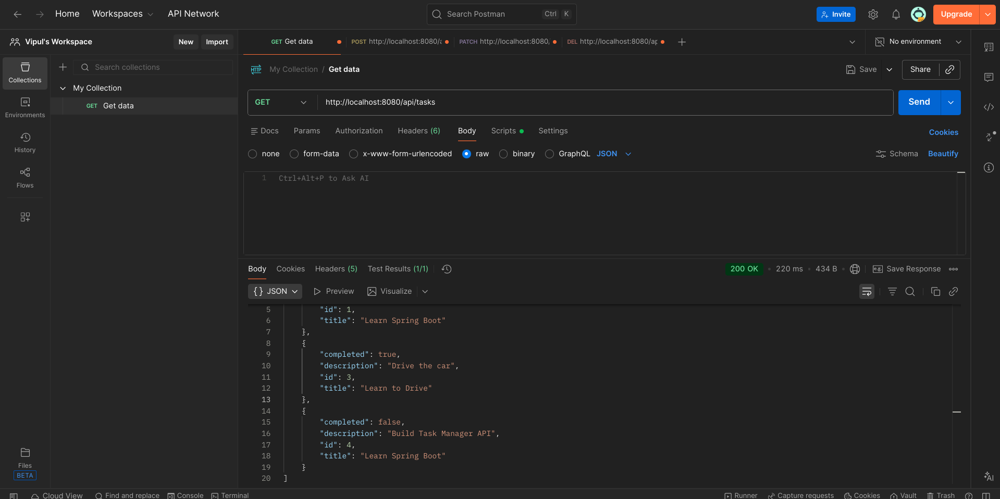
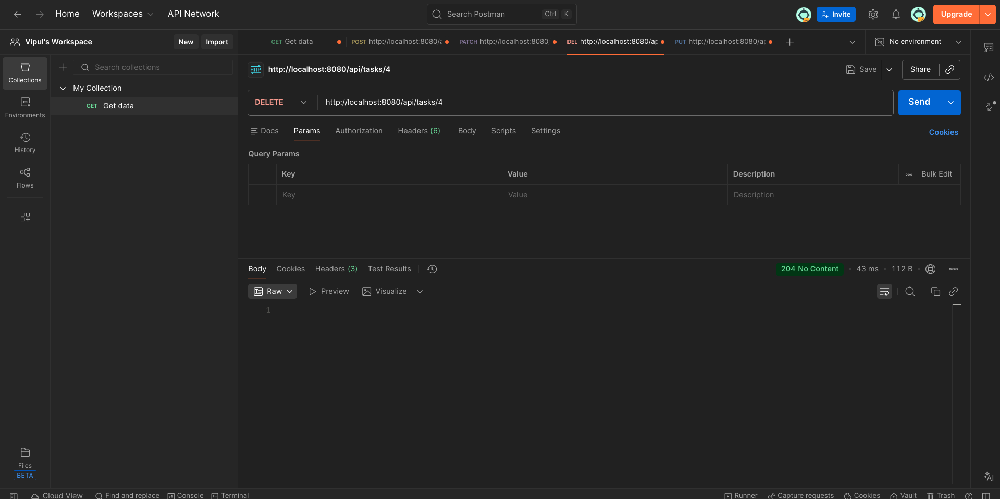
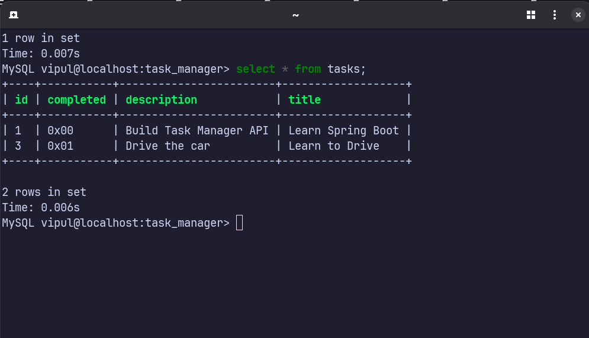

# Task Manager REST API

A backend REST API for managing tasks, built using Spring Boot and has 
clean layered architecture.

---

## Tech Stack
- Java
- Spring Boot
- Spring Data JPA
- MySQL
- MapStruct
- Maven

---

## Features
- Create a task
- Get all tasks
- Get task by ID
- Update task details
- Delete a task
- Mark task as completed
- DTO-based API design
- Clean Controller–Service–Repository architecture

---

## API Endpoints

| Method | Endpoint | Description |
|------|---------|-------------|
| POST | `/api/tasks` | Create a new task |
| GET | `/api/tasks` | Get all tasks |
| GET | `/api/tasks/{id}` | Get task by ID |
| PUT | `/api/tasks/{id}` | Update task |
| PATCH | `/api/tasks/{id}/complete` | Mark task as completed |
| DELETE | `/api/tasks/{id}` | Delete task |

---

## Architecture Overview
- **Controller Layer** handles HTTP requests and responses
- **Service Layer** contains business logic
- **Repository Layer** handles database operations using JPA
- **DTOs** are used to prevent entity exposure
- **MapStruct** is used for DTO–Entity mapping

---

## Screenshots

### Create Task (POST)

### Get All Tasks (GET)

### Update Task (PUT)

### Delete Task (DELETE)

### Database 

---

## How to Run Locally
1. Clone the repository
2. Create a MySQL database - `task_manager`
3. Update database credentials in `application.properties`
4. Run the Spring Boot application
5. Test APIs using Postman

---

